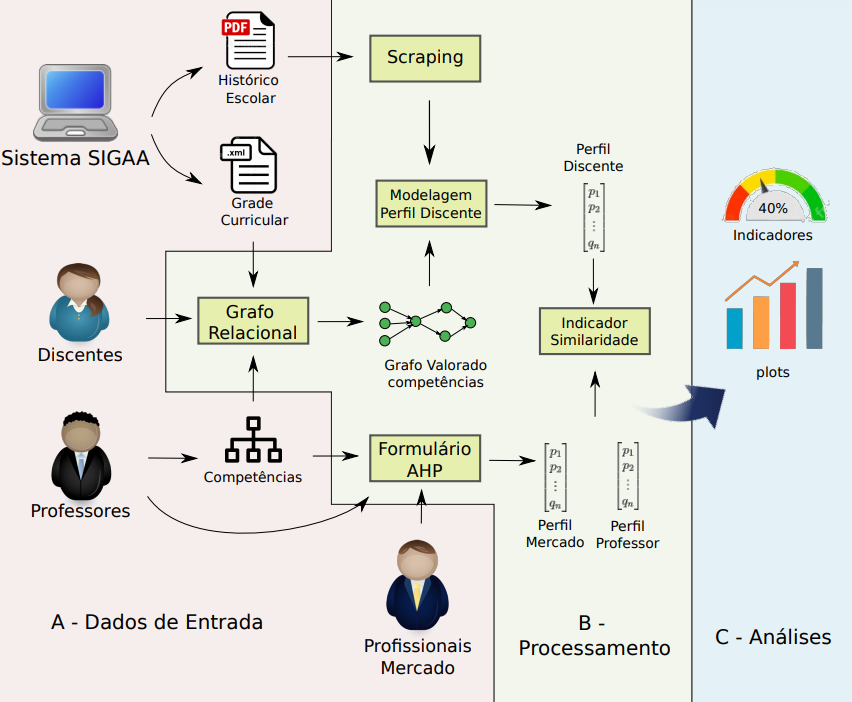

# Student's competency analisis: An graph approach

This repository contains some codes used in the article that will be published later.

---

- [Student's competency analisis: An graph approach](#students-competency-analisis-an-graph-approach)
  - [How it works?](#how-it-works)
  - [How to run](#how-to-run)
  - [Documentation](#documentation)
    - [How to document](#how-to-document)
    - [Sphinx themes:](#sphinx-themes)
  - [Tests](#tests)
  - [Some usefull commands:](#some-usefull-commands)
  - [Packages needed](#packages-needed)
  - [See also](#see-also)

---

## How it works?

This code uses the following approach:

<p align="center">
  
</p>


## How to run

The project was created and designed under "jupyter researchers" approach. Doing so, you'll need an jupyter
interface to open it.

1. [Install python](https://www.python.org/downloads/)

2. Install pip (only if you're running on linux):

  ```bash
  sudo apt install python3-pip
  ```

3. Install all dependencies

  ```bash
  cd src
  # if you have the python2 installed too
  pip3 install -r requirements.txt
  # or
  pip install -r requirements.txt

  # uninstall
  pip3 uninstall -r requirements.txt
  ```

4. You can install the graphviz by the package [site](https://graphviz.org/download/) or typing:
    - in debian-based linux:

      ```bash
      sudo apt install graphviz
      ```

    - or using a choco (windows)

      ```bash
      choco install graphviz
      ```
5. You also need to install the [plotly support for jupyter][7]:

```bash
# basic packages
pip install plotly==4.14.3
pip install "notebook>=5.3" "ipywidgets>=7.5"
pip install jupyterlab "ipywidgets>=7.5"

# The following commands needs node to be installed:
# JupyterLab renderer support
jupyter labextension install jupyterlab-plotly@4.14.3

# OPTIONAL: Jupyter widgets extension
jupyter labextension install @jupyter-widgets/jupyterlab-manager plotlywidget@4.14.3
```


* Optionally, you can create an venv (virtual env):

```bash
# install venv
sudo apt install python3-venv
# create a new venv
python3 -m venv pyenv

# Activate the virtual environment
source pyenv/bin/activate
# To deactivate the venv
deactivate
```

* You can install jupyter using:
```bash
pip3 install jupyterlab
```

> After that, opens the `./src/main.ipynb` file and run it.


## Documentation

The [documentation](src/doc/build/html/index.html) of `modules` is inside `src/doc/build/html` folder.

### How to document

The project was developed using _Google Docstrings_ and _RST (Reestructured text)_ guides.
You can check [here](https://www.google.com/search?q=google+documentation+python&oq=google+pydocumention+&aqs=chrome.1.69i57j0i13l9.8494j0j4&sourceid=chrome&ie=UTF-8) and
[here](https://www.sphinx-doc.org/en/master/usage/restructuredtext/index.html).

### Sphinx themes:

- furo (black)
- read the docs (default)
- asteroid

## Tests

- You can test the python codes using the script "tests.py":

  ```bash
  # run all the tests
  python src/tests.py
  ```

- You also can use the "vscode testing tool":
  ```raw
  Press: CTRL+SHIFT+P or F1
  and then, type: Tests:
  ```

## Some usefull commands:

```bash
# autodocumentation sphinx api (inside source folder)
sphinx-apidoc -o . ../../modules/

# generate html pages for sphinx
make html

# create a new documentation
sphinx-quickstart


# dump mongo
$ mongodump --port 27017 -u USER_NICK -p USER_PASSWORD -d DATABASE --authenticationDatabase admin -o OUTPUT_FOLDER

# restore mongo
$ mongorestore --port 27017 -u USER_NICK -p USER_PASSWORD OUTPUT_FOLDER/

# online restore
mongorestore --uri URI_CONNECTION_STRING OUTPUT_FOLDER/
```

> [Why don't use markdown to documentation](https://www.ericholscher.com/blog/2016/mar/15/dont-use-markdown-for-technical-docs/)


## See also

> To install other themes you must search for a python package equivalent for that theme.

1. [Sphinx themes][1]
2. [Sphinx automodule/autoclass errors][2]
3. [Generating automodules][3]
4. [Sphinx cross references][4]
5. [Sphinx pygments confs][5]
6. [Getting started with sphinx][6]
7. [Getting started with plotly][7]
8. [Mongo mocking (Testing for mongo)][8]

<!-- Links -->

[1]: https://sphinx-themes.org/
[2]: https://stackoverflow.com/questions/13516404/sphinx-error-unknown-directive-type-automodule-or-autoclass
[3]: https://www.youtube.com/watch?v=b4iFyrLQQh4&ab_channel=avcourt
[4]: https://stackoverflow.com/questions/34533346/incorrect-cross-reference-syntax-gives-confusing-undefined-label-warning
[5]: https://www.sphinx-doc.org/en/master/usage/configuration.html#confval-pygments_style
[6]: https://docs.readthedocs.io/en/stable/intro/getting-started-with-sphinx.html
[7]: https://plotly.com/python/getting-started/
[8]: https://github.com/mongomock/mongomock/blob/develop/tests/test__mongomock.py
